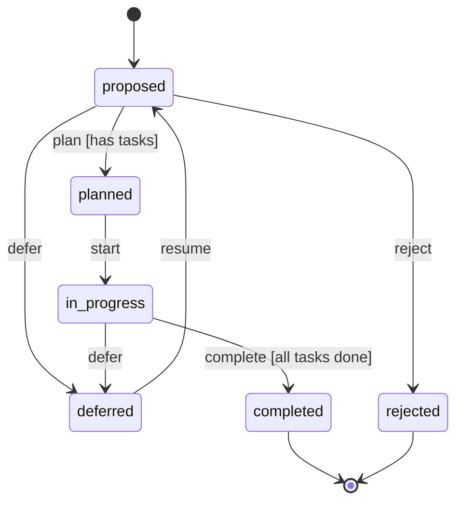

# State Machine Architecture for SpecMCP

## Overview

Replace scattered status validation guards with centralized state machine definitions using `qmuntal/stateless`.

## Benefits

1. **Centralized**: All transition rules in one place per entity type
2. **Self-documenting**: State machine IS the documentation
3. **Visualizable**: Auto-generate DOT/Mermaid diagrams
4. **Type-safe**: Compile-time validation of states/transitions
5. **Testable**: Easy to unit test state transitions in isolation
6. **Extensible**: Add new states/transitions without touching guards

## Architecture

```
internal/
  statemachine/
    statemachine.go       # Core interfaces and registry
    change.go             # Change state machine
    task.go               # Task state machine
    improvement.go        # Improvement state machine (new)
    workflow_artifact.go  # Shared Proposal/Spec/Requirement/Scenario/Design
    maintenance.go        # MaintenanceIssue state machine
    visualizer.go         # DOT/Mermaid export
```

## State Machine Definitions

### 1. Improvement State Machine

```go
package statemachine

import (
    "context"
    "fmt"
    "github.com/qmuntal/stateless"
    "github.com/emergent-company/emergent/apps/server-go/pkg/sdk"
)

// States
const (
    ImprovementProposed    = "proposed"
    ImprovementPlanned     = "planned"
    ImprovementInProgress  = "in_progress"
    ImprovementCompleted   = "completed"
    ImprovementDeferred    = "deferred"
    ImprovementRejected    = "rejected"
)

// Triggers (events that cause transitions)
const (
    ImprovementTriggerPlan     = "plan"      // proposed → planned
    ImprovementTriggerStart    = "start"     // planned → in_progress
    ImprovementTriggerComplete = "complete"  // in_progress → completed
    ImprovementTriggerDefer    = "defer"     // proposed/planned → deferred
    ImprovementTriggerReject   = "reject"    // proposed → rejected
    ImprovementTriggerResume   = "resume"    // deferred → proposed
)

type ImprovementContext struct {
    Client         *emergent.Client
    ImprovementID  string
    Force          bool
}

func NewImprovementStateMachine(currentState string, ctx *ImprovementContext) *stateless.StateMachine {
    sm := stateless.NewStateMachine(currentState)
    
    // proposed → planned (when tasks are added)
    sm.Configure(ImprovementProposed).
        Permit(ImprovementTriggerPlan, ImprovementPlanned).
        Permit(ImprovementTriggerDefer, ImprovementDeferred).
        Permit(ImprovementTriggerReject, ImprovementRejected).
        OnEntry(func(_ context.Context, _ ...any) error {
            // Set proposed_at timestamp
            return nil
        })
    
    // planned → in_progress (when someone starts work)
    sm.Configure(ImprovementPlanned).
        PermitIf(ImprovementTriggerStart, ImprovementInProgress, 
            func(_ context.Context, _ ...any) bool {
                // Guard: Must have at least one task
                tasks, _ := ctx.Client.GetRelatedObjects(ctx.ImprovementID, "has_task")
                if len(tasks) == 0 && !ctx.Force {
                    return false // Block transition
                }
                return true
            }, "Must have at least one task before starting").
        Permit(ImprovementTriggerDefer, ImprovementDeferred).
        OnEntry(func(_ context.Context, _ ...any) error {
            // Set planned_at timestamp
            return nil
        })
    
    // in_progress → completed (when all tasks done)
    sm.Configure(ImprovementInProgress).
        PermitIf(ImprovementTriggerComplete, ImprovementCompleted,
            func(_ context.Context, _ ...any) bool {
                // Guard: All tasks must be completed
                tasks, _ := ctx.Client.GetRelatedObjects(ctx.ImprovementID, "has_task")
                for _, task := range tasks {
                    if task.Properties["status"] != "completed" && !ctx.Force {
                        return false
                    }
                }
                return true
            }, "All tasks must be completed").
        Permit(ImprovementTriggerDefer, ImprovementDeferred)
    
    // completed (terminal state)
    sm.Configure(ImprovementCompleted).
        OnEntry(func(_ context.Context, _ ...any) error {
            // Set completed_at timestamp
            return nil
        })
    
    // deferred → proposed (resume work)
    sm.Configure(ImprovementDeferred).
        Permit(ImprovementTriggerResume, ImprovementProposed)
    
    // rejected (terminal state)
    sm.Configure(ImprovementRejected)
    
    return sm
}
```

### 2. Task State Machine

```go
const (
    TaskPending    = "pending"
    TaskInProgress = "in_progress"
    TaskCompleted  = "completed"
    TaskBlocked    = "blocked"
)

const (
    TaskTriggerStart    = "start"
    TaskTriggerComplete = "complete"
    TaskTriggerBlock    = "block"
    TaskTriggerUnblock  = "unblock"
)

func NewTaskStateMachine(currentState string, ctx *TaskContext) *stateless.StateMachine {
    sm := stateless.NewStateMachine(currentState)
    
    sm.Configure(TaskPending).
        Permit(TaskTriggerStart, TaskInProgress).
        Permit(TaskTriggerBlock, TaskBlocked)
    
    sm.Configure(TaskInProgress).
        PermitIf(TaskTriggerComplete, TaskCompleted,
            func(_ context.Context, _ ...any) bool {
                // Guard: Subtasks must be completed
                subtasks, _ := ctx.Client.GetRelatedObjects(ctx.TaskID, "has_subtask")
                for _, sub := range subtasks {
                    if sub.Properties["status"] != "completed" && !ctx.Force {
                        return false
                    }
                }
                return true
            }, "All subtasks must be completed").
        Permit(TaskTriggerBlock, TaskBlocked).
        OnEntry(func(_ context.Context, _ ...any) error {
            // Set started_at timestamp
            return nil
        })
    
    sm.Configure(TaskBlocked).
        Permit(TaskTriggerUnblock, TaskPending)
    
    sm.Configure(TaskCompleted).
        OnEntry(func(_ context.Context, _ ...any) error {
            // Set completed_at timestamp
            // Calculate actual_hours from started_at → completed_at
            return nil
        })
    
    return sm
}
```

### 3. Workflow Artifact State Machine (Proposal, Spec, Requirement, Scenario, Design)

```go
const (
    ArtifactDraft = "draft"
    ArtifactReady = "ready"
)

const (
    ArtifactTriggerMarkReady = "mark_ready"
    ArtifactTriggerUnready   = "unready"
)

func NewWorkflowArtifactStateMachine(artifactType, currentState string, ctx *ArtifactContext) *stateless.StateMachine {
    sm := stateless.NewStateMachine(currentState)
    
    sm.Configure(ArtifactDraft).
        PermitIf(ArtifactTriggerMarkReady, ArtifactReady,
            func(_ context.Context, _ ...any) bool {
                // Guard: Depends on artifact type
                switch artifactType {
                case "Spec":
                    // All requirements must be ready
                    reqs, _ := ctx.Client.GetRelatedObjects(ctx.ArtifactID, "has_requirement")
                    for _, req := range reqs {
                        if req.Properties["status"] != "ready" && !ctx.Force {
                            return false
                        }
                    }
                case "Requirement":
                    // All scenarios must be ready
                    scenarios, _ := ctx.Client.GetRelatedObjects(ctx.ArtifactID, "has_scenario")
                    for _, sc := range scenarios {
                        if sc.Properties["status"] != "ready" && !ctx.Force {
                            return false
                        }
                    }
                }
                return true
            }, "Child artifacts must be ready first")
    
    sm.Configure(ArtifactReady).
        Permit(ArtifactTriggerUnready, ArtifactDraft) // Allow going back to draft
    
    return sm
}
```

### 4. Change State Machine

```go
const (
    ChangeActive   = "active"
    ChangeArchived = "archived"
)

const (
    ChangeTriggerArchive   = "archive"
    ChangeTriggerUnarchive = "unarchive"
)

func NewChangeStateMachine(currentState string, ctx *ChangeContext) *stateless.StateMachine {
    sm := stateless.NewStateMachine(currentState)
    
    sm.Configure(ChangeActive).
        PermitIf(ChangeTriggerArchive, ChangeArchived,
            func(_ context.Context, _ ...any) bool {
                // Guard: All tasks must be completed (or force=true)
                tasks, _ := ctx.Client.GetRelatedObjects(ctx.ChangeID, "has_task")
                for _, task := range tasks {
                    if task.Properties["status"] != "completed" && !ctx.Force {
                        return false
                    }
                }
                return true
            }, "All tasks must be completed before archiving")
    
    sm.Configure(ChangeArchived).
        Permit(ChangeTriggerUnarchive, ChangeActive)
    
    return sm
}
```

## Integration with Tools

### Before: Scattered Validation
```go
// In spec_mark_ready tool
func (t *MarkReadyTool) Execute(ctx context.Context, params json.RawMessage) (*ToolsCallResult, error) {
    // Manual validation scattered everywhere
    if spec.Status == "ready" {
        return nil, fmt.Errorf("already ready")
    }
    
    // Check child requirements manually
    reqs, _ := t.client.GetRelatedObjects(specID, "has_requirement")
    for _, req := range reqs {
        if req.Properties["status"] != "ready" && !force {
            return nil, fmt.Errorf("requirement %s not ready", req.ID)
        }
    }
    
    // Update status manually
    spec.Status = "ready"
    t.client.UpdateObject(...)
}
```

### After: State Machine Driven
```go
// In spec_mark_ready tool
func (t *MarkReadyTool) Execute(ctx context.Context, params json.RawMessage) (*ToolsCallResult, error) {
    spec := getSpec(input.SpecID)
    
    smCtx := &ArtifactContext{
        Client:     t.client,
        ArtifactID: spec.ID,
        Force:      input.Force,
    }
    
    sm := NewWorkflowArtifactStateMachine("Spec", spec.Status, smCtx)
    
    // Attempt transition - state machine handles all validation
    if err := sm.Fire(ArtifactTriggerMarkReady); err != nil {
        return nil, fmt.Errorf("cannot mark ready: %w", err)
    }
    
    // Update in graph
    spec.Status = sm.MustState()
    t.client.UpdateObject(spec)
    
    return &ToolsCallResult{
        Content: []Content{{
            Type: "text",
            Text: fmt.Sprintf("Marked %s as ready", spec.Name),
        }},
    }
}
```

## State Machine Registry

```go
package statemachine

type Registry struct {
    machines map[string]StateMachineFactory
}

type StateMachineFactory func(currentState string, ctx any) *stateless.StateMachine

func NewRegistry() *Registry {
    r := &Registry{
        machines: make(map[string]StateMachineFactory),
    }
    
    // Register all state machines
    r.Register("Improvement", func(state string, ctx any) *stateless.StateMachine {
        return NewImprovementStateMachine(state, ctx.(*ImprovementContext))
    })
    r.Register("Task", func(state string, ctx any) *stateless.StateMachine {
        return NewTaskStateMachine(state, ctx.(*TaskContext))
    })
    r.Register("Change", func(state string, ctx any) *stateless.StateMachine {
        return NewChangeStateMachine(state, ctx.(*ChangeContext))
    })
    
    // Workflow artifacts share a factory
    for _, typ := range []string{"Proposal", "Spec", "Requirement", "Scenario", "Design"} {
        typ := typ
        r.Register(typ, func(state string, ctx any) *stateless.StateMachine {
            return NewWorkflowArtifactStateMachine(typ, state, ctx.(*ArtifactContext))
        })
    }
    
    return r
}

func (r *Registry) Get(entityType string, currentState string, ctx any) (*stateless.StateMachine, error) {
    factory, ok := r.machines[entityType]
    if !ok {
        return nil, fmt.Errorf("no state machine registered for %s", entityType)
    }
    return factory(currentState, ctx), nil
}
```

## Visualization Export

```go
package statemachine

import (
    "github.com/qmuntal/stateless"
)

func ExportDOT(sm *stateless.StateMachine) string {
    // qmuntal/stateless has built-in DOT export
    return sm.ToGraph()
}

func ExportMermaid(sm *stateless.StateMachine) string {
    // Convert to Mermaid syntax for embedding in markdown
    dot := sm.ToGraph()
    // Transform DOT → Mermaid (simple parser)
    return convertDOTtoMermaid(dot)
}
```

Example output:


## Migration Plan

1. **Phase 1**: Add `qmuntal/stateless` dependency
2. **Phase 2**: Create `internal/statemachine` package with all definitions
3. **Phase 3**: Refactor existing tools to use state machines
4. **Phase 4**: Remove old scattered validation guards
5. **Phase 5**: Add visualization endpoint/tool

## Testing Benefits

State machines are trivial to unit test:

```go
func TestImprovementStateMachine(t *testing.T) {
    ctx := &ImprovementContext{Force: false}
    sm := NewImprovementStateMachine(ImprovementProposed, ctx)
    
    // Valid transition
    err := sm.Fire(ImprovementTriggerPlan)
    assert.NoError(t, err)
    assert.Equal(t, ImprovementPlanned, sm.MustState())
    
    // Invalid transition (no tasks)
    err = sm.Fire(ImprovementTriggerStart)
    assert.Error(t, err) // Should block
    
    // Force transition
    ctx.Force = true
    err = sm.Fire(ImprovementTriggerStart)
    assert.NoError(t, err)
}
```

## Documentation Benefits

Auto-generate workflow docs:

```bash
# Generate state machine diagram for Improvement
./specmcp state-machine-diagram Improvement > docs/improvement-workflow.dot
dot -Tpng docs/improvement-workflow.dot -o docs/improvement-workflow.png
```

This becomes the **source of truth** for entity lifecycles.
